# Cat Night

Cat Night é um jogo para desktop em desenvolvimento como projeto final para a disciplina Laboratório de Programação de Jogos da Universidade Federal.

## Menu

## Tela de seleção de personagem

## Jogo

## Menu Pause
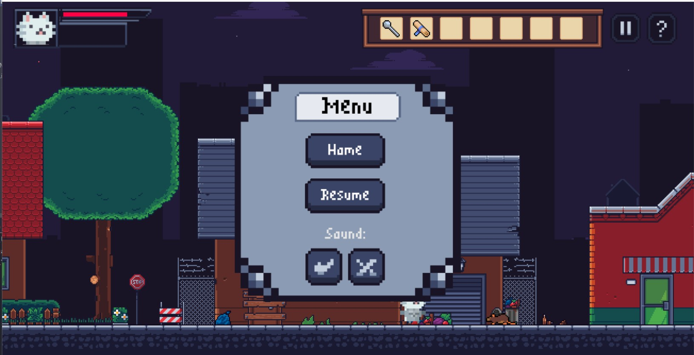

## Menu ajuda
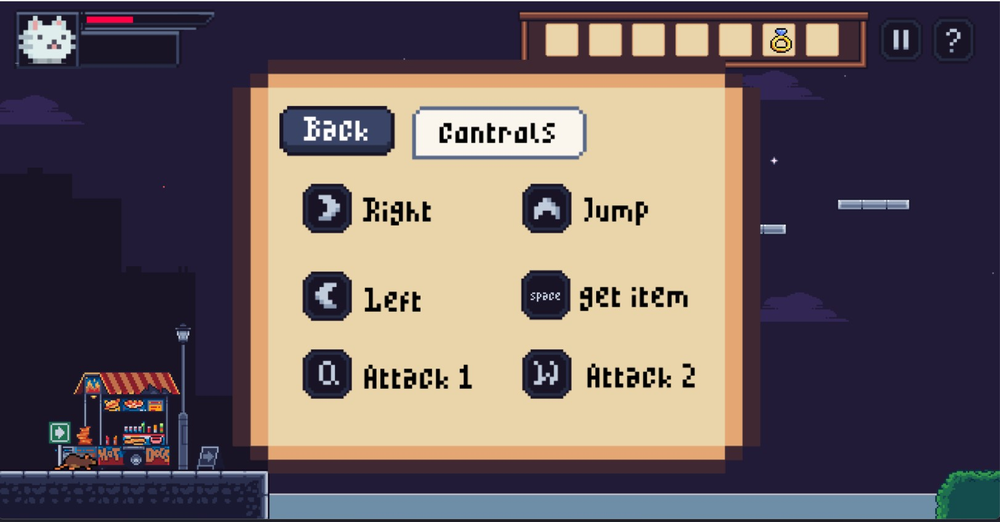

# Cena de transição
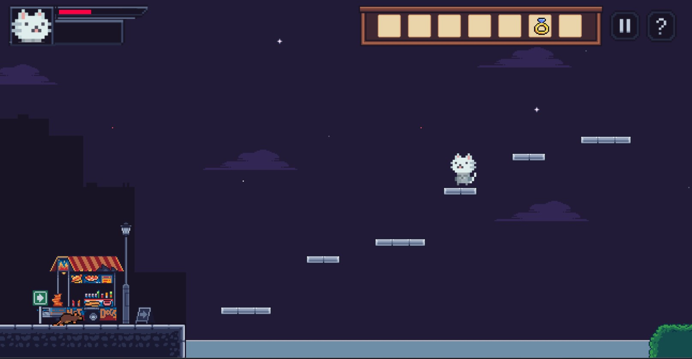

# Cena Final
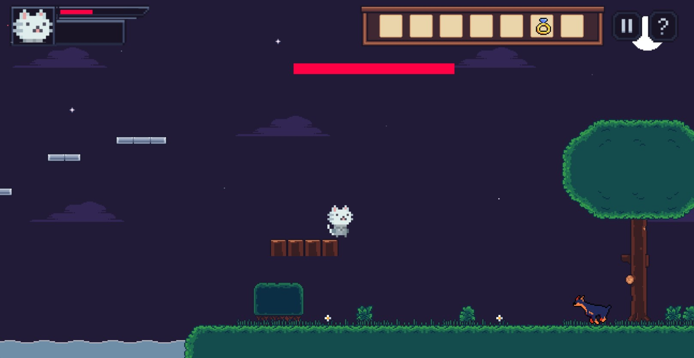

# Tela de derrota
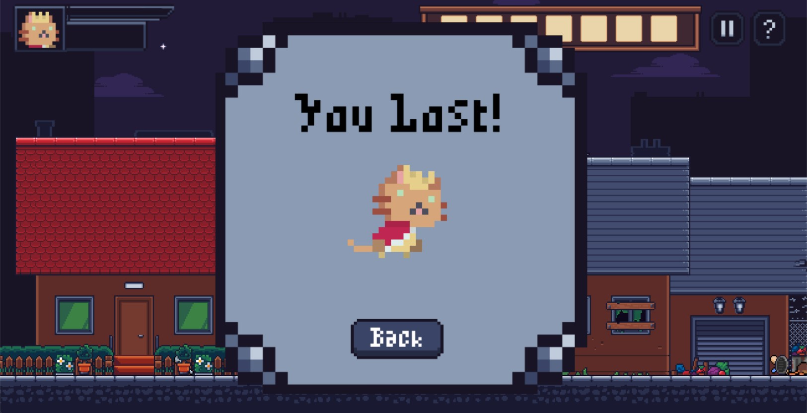
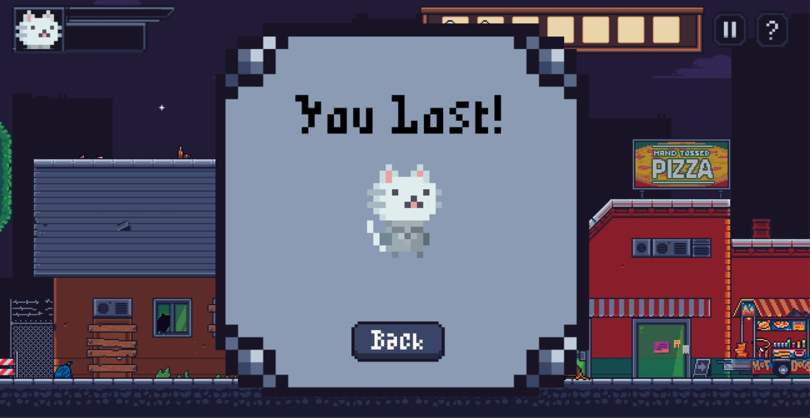
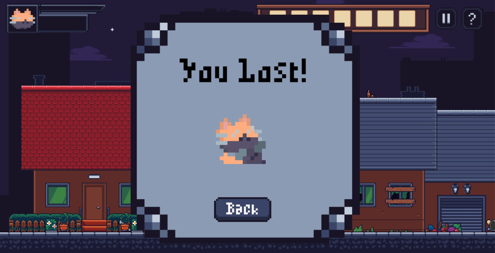
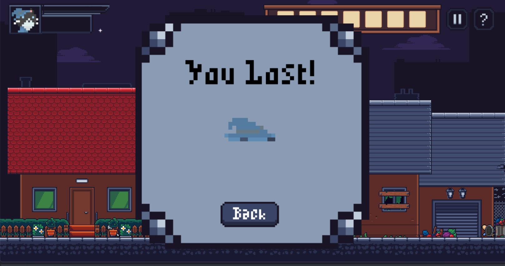

# Baú
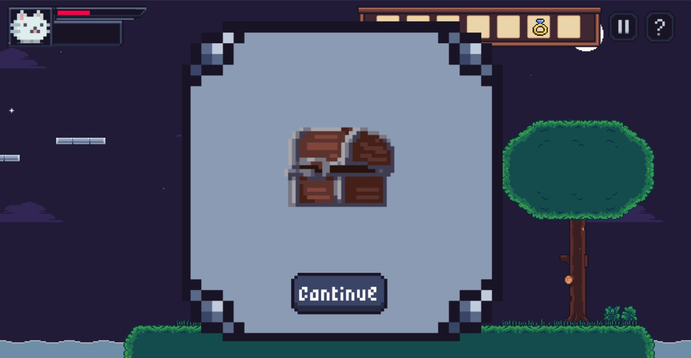

# Tela de vitória
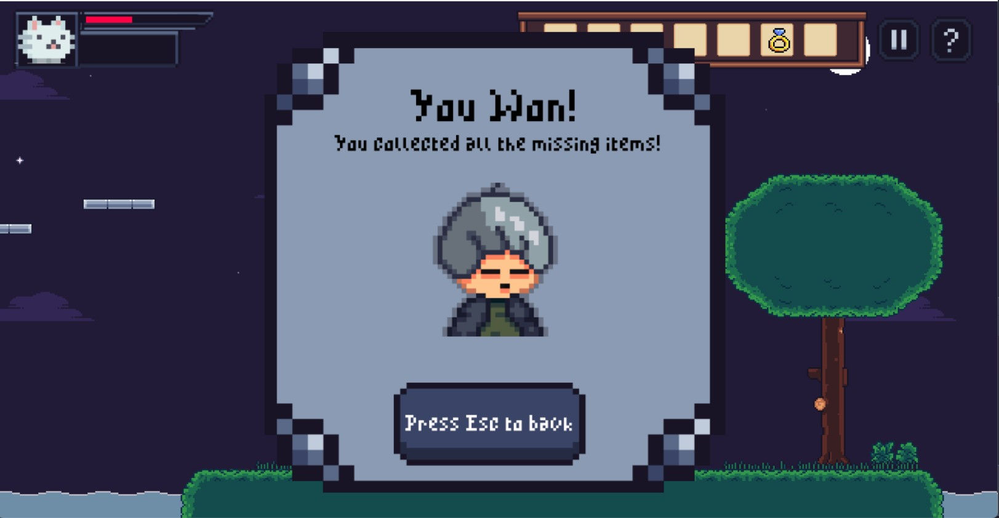

# GUI

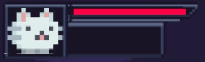
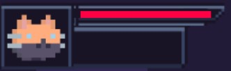
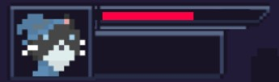

# Créditos
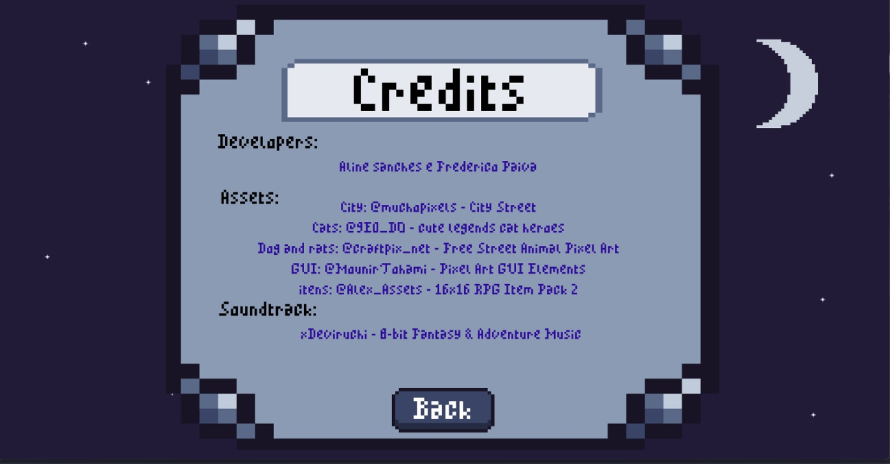