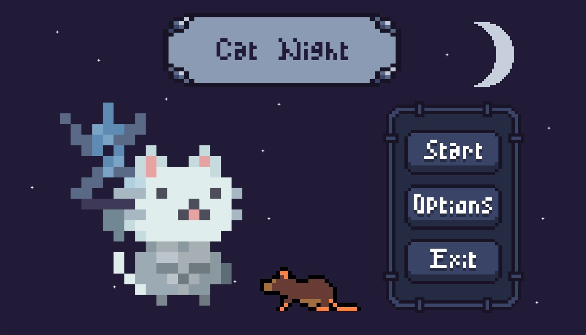

#Cat Night

Cat Night é um jogo para desktop em desenvolvimento como projeto final para a disciplina Laboratório de Programação de Jogos da Universidade Federal.

## Menu

## Tela de seleção de personagem

## Jogo (tela provisória)
